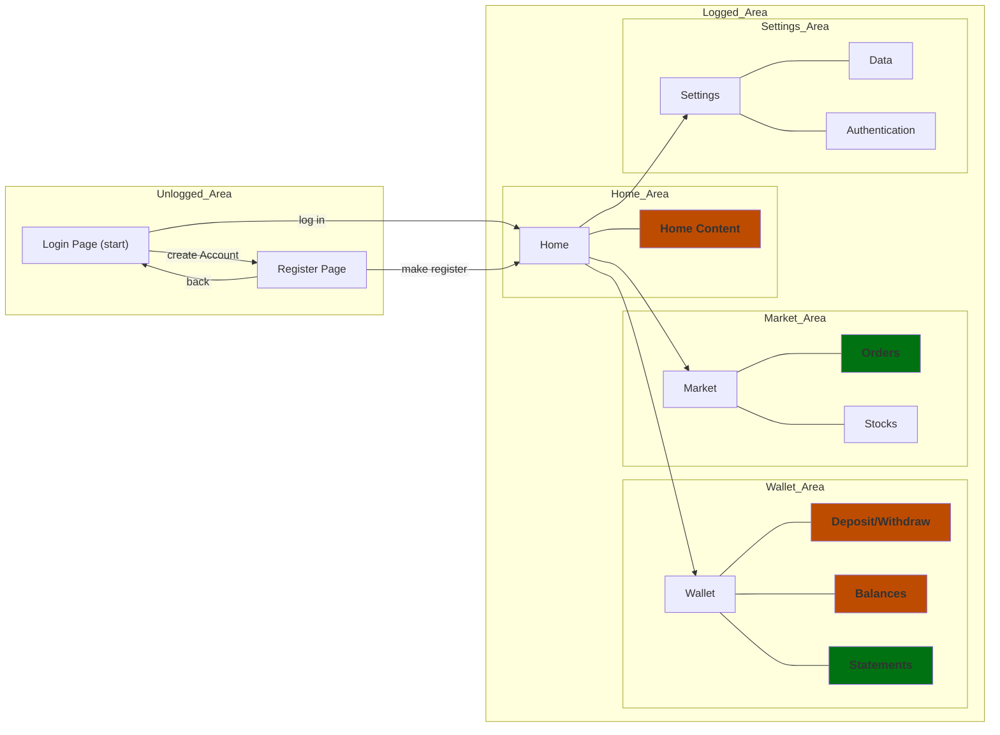

```mermaid
---
config:
  flowchart:
    htmlLabels: false
---
flowchart LR

    classDef warning fill: #be4c00ff, font-weight: bold, font-size: 13pt
    classDef suggest fill: #007211ff, font-weight: bold, font-size: 13pt
        
    subgraph Unlogged_Area
    loginPage["Login Page (start)"]
    register["Register Page"]
    end
    
    subgraph Logged_Area

        subgraph Home_Area
            home["Home"]
            content["Home Content"]
        end

        subgraph Wallet_Area
            wallet["Wallet"]
            money_io["Deposit/Withdraw"]
            balances["Balances"]
            statements["Statements"]
            
        end
    
        subgraph Market_Area
            market["Market"]
            orders["Orders"]
            stocks["Stocks"]
        end
    
        subgraph Settings_Area
            settings["Settings"]
            user_profile["Data"]
            auth["Authentication"]
        end
    
    loginPage -->|log in| home
    loginPage -->|create Account| register
    register -->|back| loginPage
    register -->|make register| home
    
    home --> wallet
    home --> market
    home --> settings
    
    home --- content:::warning

    wallet --- money_io:::warning
    wallet --- balances:::warning
    wallet --- statements:::suggest

    market --- orders:::suggest
    market --- stocks

    settings --- user_profile
    settings --- auth
    
    end
```